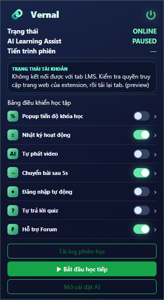
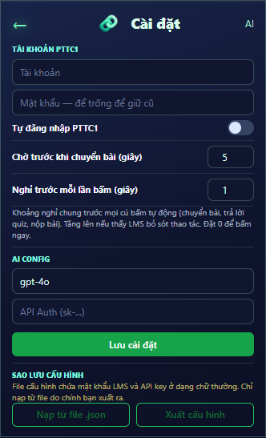

<div align="center">


<table align="center">
  <tr>
    <td>
      <pre>
██╗   ██╗███████╗██████╗ ███╗   ██╗ █████╗ ██╗
██║   ██║██╔════╝██╔══██╗████╗  ██║██╔══██╗██║
██║   ██║█████╗  ██████╔╝██╔██╗ ██║███████║██║
╚██╗ ██╔╝██╔══╝  ██╔══██╗██║╚██╗██║██╔══██║██║
 ╚████╔╝ ███████╗██║  ██║██║ ╚████║██║  ██║███████╗
  ╚═══╝  ╚══════╝╚═╝  ╚═╝╚═╝  ╚═══╝╚═╝  ╚═╝╚══════╝
      </pre>
    </td>
  </tr>
</table>

<p align="center"><sub>LEARNING COMPANION</sub></p>


<h3 align="center">Trợ lý học trực tuyến có kiểm soát dành cho Chrome</h3>

<p align="center">Hỗ trợ theo dõi tiến độ, tiếp tục khóa học, điều khiển video và chuẩn bị bản nháp thảo luận — người học luôn là người quyết định thao tác cuối cùng.</p>

</div>

---

## Giới thiệu

**Vernal** là Chrome extension xây dựng bằng **WXT**, **React** và **JavaScript (ESM)**, được thiết kế để hỗ trợ luồng học trên LMS. Extension hiện có adapter riêng cho PTTC1 Moodle và một adapter tổng quát cho các LMS phù hợp.


> Vernal không tự gửi bài thảo luận và không tự thu thập mật khẩu. Các tính năng tự động đều có thể bật/tắt trong extension.

## Giao diện extension

<div align="center">
  <table>
    <tr>
      <td align="center" valign="top">
        <br />
        <sub><b>Màn hình chính</b><br />Trạng thái phiên học và điều khiển nhanh.</sub>
      </td>
      <td align="center" valign="top">
        <br />
        <sub><b>Cài đặt</b><br />Tài khoản, thời gian chờ, AI và sao lưu cấu hình.</sub>
      </td>
    </tr>
  </table>
</div>

## Điểm nổi bật

| Tính năng | Mô tả |
| --- | --- |
| 🎬 Hỗ trợ video | Tự phát video khi bạn bật tính năng; nhận diện video trong trang hoặc iframe được hỗ trợ. |
| ➡️ Chuyển bài có kiểm soát | Chuyển sang hoạt động tiếp theo sau thời gian chờ đã cấu hình. Mặc định chỉ hoạt động tại domain được cho phép. |
| 📚 Tiếp tục học | Tìm khóa học có tiến độ thấp và hỗ trợ mở lại luồng học. |
| 📊 Bảng tiến độ | Hiển thị bảng tóm tắt tiến độ khóa học trên trang dashboard Moodle. |
| ✨ Hỗ trợ Forum bằng AI | Tạo **bản nháp** câu hỏi/trả lời qua LLM gateway để người dùng xem và chỉnh sửa trước khi gửi. |
| 🧩 Trích xuất quiz | Hỗ trợ trích xuất câu hỏi quiz khi được bật trong cài đặt. |
| 🗂️ Nhật ký phiên học | Lưu nhật ký qua các lần chuyển trang và xuất tệp `.log` vào `Downloads/Vernal/logs/`. |
| 💾 Sao lưu cài đặt | Xuất/nhập cấu hình JSON; cẩn trọng vì tệp sao lưu có thể chứa thông tin nhạy cảm. |

## Cài đặt và chạy phát triển

### Yêu cầu

- Node.js **22+**
- Google Chrome hoặc trình duyệt Chromium tương thích

### Khởi chạy

```bash
npm install
npm run dev
```

Lệnh trên khởi chạy môi trường WXT ở chế độ phát triển. Mở trang quản lý extension của Chrome, bật **Developer mode**, rồi nạp thư mục build do WXT tạo ra nếu trình duyệt không tự mở.

### Kiểm tra và phát hành

```bash
# Kiểm tra mã nguồn
npm run lint
npm run format:check

# Tạo bản build và gói cài đặt
npm run build
npm run zip
```

## Cách sử dụng nhanh

1. Cài extension ở chế độ phát triển hoặc từ gói phát hành.
2. Mở trang LMS được hỗ trợ và đăng nhập **trực tiếp trên LMS**.
3. Mở popup Vernal để bật/tắt hỗ trợ video, chuyển bài, bảng tiến độ và các tùy chọn khác.
4. Nếu dùng AI, cấu hình model và khóa/gateway của bạn trong phần cài đặt.
5. Khi cần đối chiếu phiên học, chọn **Tải log phiên học** trong popup.

## Cấu hình AI

Vernal gọi LLM thông qua gateway tương thích chat completions. Sao chép tệp mẫu và thay bằng endpoint của bạn:

```powershell
Copy-Item .env.example .env
```

```env
WXT_LLM_ENDPOINT=https://your-gateway.example.com/v1/chat/completions
```

Không commit khóa thật. Với môi trường sản xuất, nên gọi LLM qua backend/gateway của riêng bạn thay vì nhúng khóa bí mật vào extension.

## Cấu trúc dự án

```text
entrypoints/       # Điểm vào WXT: background, content, popup, options
src/background/    # Điều phối runtime message và tác vụ nền
src/content/       # Logic chạy trong trang LMS
src/providers/     # Adapter theo từng LMS; selector đặc thù nằm tại đây
src/services/      # Tích hợp LLM, liên kết tài khoản, nhật ký
src/shared/        # Settings, hằng số và browser helpers
src/ui/            # Theme và kiểu giao diện dùng chung
public/icons/      # Biểu tượng đóng gói cùng extension
```

## Thêm một LMS mới

1. Tạo `src/providers/<ten-lms>.provider.js`.
2. Cài đặt các hàm cần thiết như `matches`, `findVideo`, `findVideoFrame`, `findNextButton` và `findDiscussionInput`.
3. Đăng ký provider tại `src/providers/provider-registry.js`; đặt provider đặc thù trước provider tổng quát.
4. Cấu hình domain LMS trong Options trước khi bật các tính năng tự động.

Giữ selector riêng của LMS trong provider; phần điều phối dùng chung thuộc `src/content/learning-controller.js`.

## Nguyên tắc an toàn & sử dụng có trách nhiệm

- Người dùng đăng nhập trực tiếp trên LMS; Vernal không thu thập mật khẩu.
- Tự chuyển bài mặc định cần được người dùng bật và chỉ nên dùng ở domain tin cậy.
- AI chỉ tạo bản nháp. Hãy luôn xem lại nội dung trước khi gửi.
- Tôn trọng quy chế khóa học, bản quyền, chính sách LMS và yêu cầu của giảng viên.
- Tệp sao lưu cấu hình có thể chứa API key/mật khẩu dạng văn bản thường; chỉ lưu trữ và chia sẻ ở nơi an toàn.

## Scripts

| Lệnh | Mục đích |
| --- | --- |
| `npm run dev` | Chạy extension ở chế độ phát triển với WXT |
| `npm run build` | Tạo bản build production |
| `npm run zip` | Đóng gói extension |
| `npm run lint` | Chạy ESLint |
| `npm run format` | Định dạng mã nguồn bằng Prettier |
| `npm run format:check` | Kiểm tra định dạng mã nguồn |

---

<div align="center">
  <sub>Vernal — học tập có nhịp điệu, kiểm soát vẫn ở trong tay bạn.</sub>
</div>
